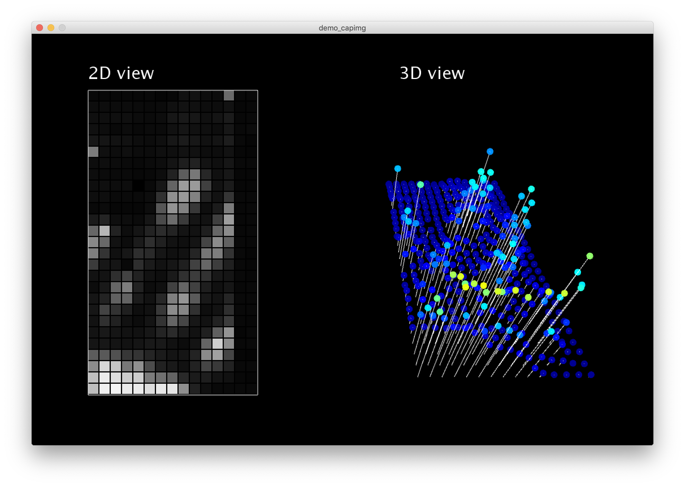

# Nexus5_CapImg

1) Install kernel to get access to capacitive image: http://huyle.de/2019/02/12/accessing-capacitive-images/

2) Install Processing: https://processing.org

3) Run bash script
```
sh loopcat.sh
```

4) Run Processing Code

Screenshots:
